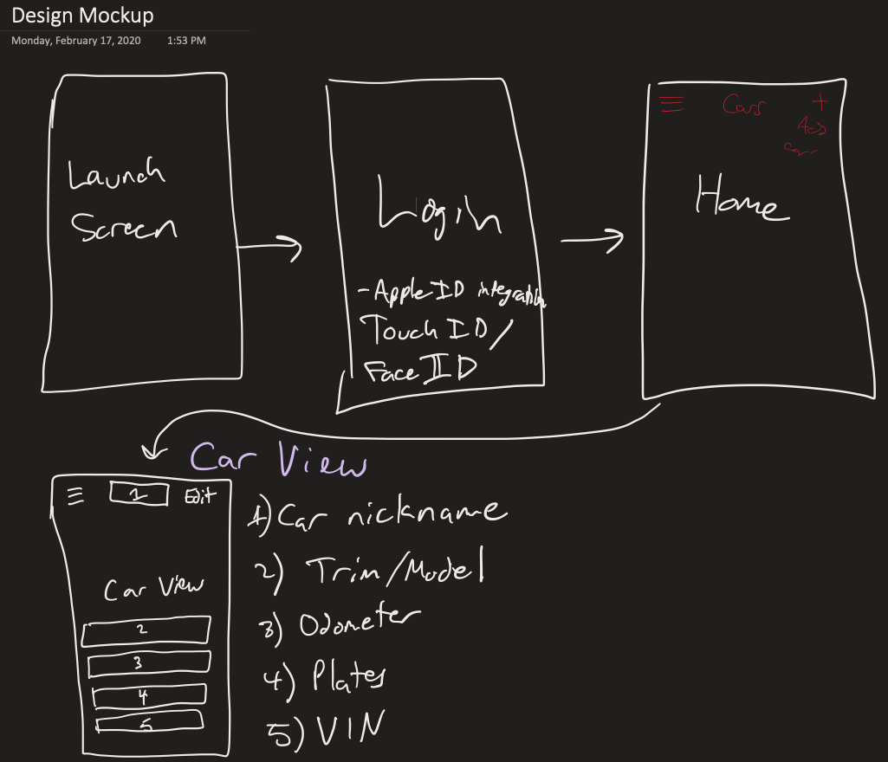
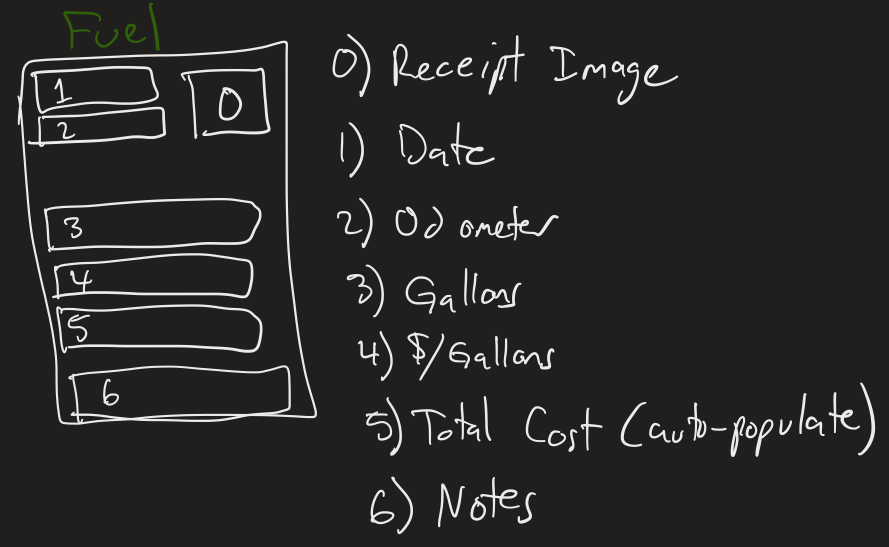
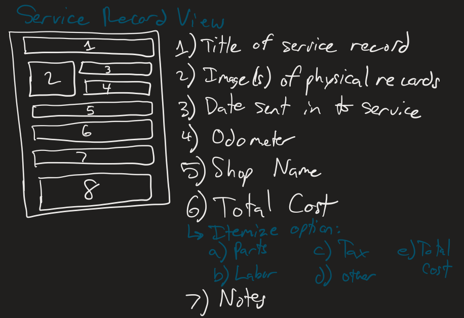
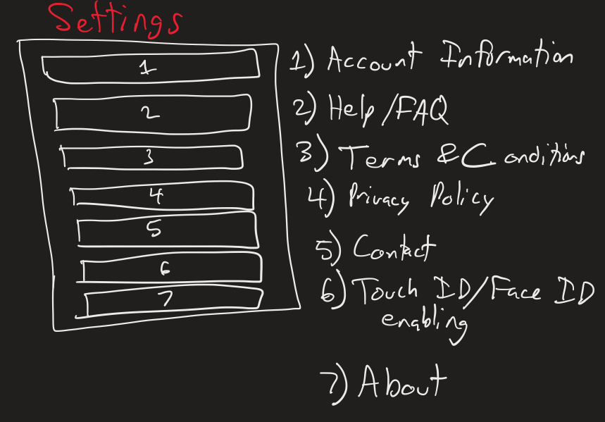

Group Project - README Template
===

# MotorNotes

## Table of Contents
1. [Overview](#Overview)
1. [Product Spec](#Product-Spec)
1. [Wireframes](#Wireframes)
2. [Schema](#Schema)

## Overview
### Description
Keep track of all your car related needs, from keeping track of mileage to tracking fuel costs and repairs, MotorNotes will help you keep track of your vehicle’s health.

### App Evaluation
- **Category:** Utility
- **Mobile:** This app would be primarily developed for mobile users, but would perhaps be viable as a web application that users can access online.
- **Story:** Records information on service records, fuel records, and general information about the vehicle.
- **Market:** Anyone that owns a vehicle could use this app to keep track of their car’s maintenance status and overall health.
- **Habit:** This app would be used occasionally, as the user sees fit. For instance, the user can use this app when filling up on gas and after they receive their vehicle from a car shop.
- **Scope:** Our app would first show the user how to work with the application and how to record information for their vehicle. This application could evolve to giving users useful information, such as affordable gas stations near their location.

## Product Spec

### 1. User Stories (Required and Optional)

**Required Must-have Stories**

- [] User sees app icon in home screen and styled launch screen
- [] User can log in and log out
- [] User stays logged in across restarts.
- [] User can create a vehicle.
- [] User can record information about their vehicle.
- [] User can create service records for their vehicle.
- [] User can create fuel records for their vehicle.
- [] User can access information related to their vehicle.
- [] User can change settings for their vehicle.
- [] User can update information and records for their vehicle.
- [] User can delete information and records for their vehicle.
- [] User can delete their vehicle.

**Optional Nice-to-have Stories**

* [] User can record insurance information for their vehicle.
* [] User can share their vehicle records with other users.
* [] User can generate metric reports for their vehicle.
* [] User can find nearby affordable gas stations to fill up.
* [] User gets notified of last oil change, tire rotation, etc.
* [] User can record favorite car shops and service locations.
* [] User can record two vehicles per account.

### 2. Screen Archetypes

* [list first screen here]
   * [list associated required story here]
   * ...
* [list second screen here]
   * [list associated required story here]
   * ...

### 3. Navigation

**Tab Navigation** (Tab to Screen)

* [fill out your first tab]
* [fill out your second tab]
* [fill out your third tab]

**Flow Navigation** (Screen to Screen)

* [list first screen here]
   * [list screen navigation here]
   * ...
* [list second screen here]
   * [list screen navigation here]
   * ...

## Wireframes

## Wireframes

## Schema 
### Models
#### Car

   | Property          | Type     | Description |
   | -------------     | -------- | ------------|
   | objectId          | String   | Unique ID for the user's car object |
   | carImage          | File     | User can insert an image of the car |
   | vin               | String   | User can put their car's VIN number. |
   | odometer          | Number   | User can put their car's odometer. |
   | make              | String   | The user's make for their vehicle (i.e. Ford) |
   | model             | String   | The user's model for their vehicle (i.e. Mustang) |
   | plate_num         | String   | The user's license plates for their vehicle |
   | car_nickname      | String   | The user's nickname for their vehicle (optional) |
   | color             | String   | The user's vehicle color. |
   | registration_date | DateTime | The user's vehicle registration date. |
   | datePosted        | DateTime | Date when user created car object |
   | dateUpdated       | DateTime | Date when user updates car object|

#### Fuel

   | Property          | Type     | Description |
   | -------------     | -------- | ------------|
   | objectId          | String   | Unique ID for the user's fuel record |
   | receiptImage      | File     | User can insert an image of the fuel receipt |
   | odometer          | Number   | User can put their car's odometer. |
   | gallonsFilledUp   | Number   | User can put how many gallons they filled up with their vehicle |
   | gasStation        | String   | The name of the gas station the user filled up at |
   | gasPricePerGallon | Number   | The price per gallon that the user paid for |
   | total             | Number   | The total cost that the user spent on filling up on gas |
   | gasType           | String   | The type of gas the user filled their vehicle up with (Regular, Unleaded, Premium) |
   | gasNotes          | String   | General notes that the user may want to enter regarding their fillup. |
   | dateFillUp        | DateTime | The date the user filled up their vehicle. |
   | datePosted        | DateTime | Date when user created car object |
   | dateUpdated       | DateTime | Date when user updates car object|
   
#### Service

   | Property      | Type     | Description |
   | ------------- | -------- | ------------|
   | objectId      | String   | Unique ID for the user's service record |
   | serviceImage  | File     | User can insert an image of the service record |
   | odometer      | Number   | User can put their car's odometer. |
   | serviceType   | String   | The type of service the user had performed on their vehicle. |
   | shopName      | String   | The name of the car shop the user took their car to. |
   | shopLocation  | String   | The car shop's location that the user took their vehicle to. |
   | total         | String   | The total cost that the user spent on car repairs. |
   | serviceNotes  | String   | General notes that the user may want to enter regarding their service. |
   | serviceDate   | DateTime | The date the user got their vehicle from the shop. |
   | datePosted    | DateTime | Date when user created car object |
   | dateUpdated   | DateTime | Date when user updates car object|
   
### Networking
- Home Screen
    - (Read/GET) Query all cars where user is owner
    - (Create/POST) Create a new car for the user
- Car View Screen
    - (Read/GET) Query all information about the current car
    - (Create/POST) Create a new service record
    - (Create/POST) Create a new fuel record
    - (Update/PUT) Update information about the car
    - (Delete) Delete the current car
- Fuel View Screen
    - (Read/GET) Query all information about fuel records for the current car
    - (Create/POST) Create individual fuel record
    - (Update/PUT) Update fuel record information about the car
    - (Delete) Delete the fuel record
- Service View Screen
    - (Read/GET) Query all information about service records for the current car
    - (Create/POST) Create individual service record
    - (Update/PUT) Update service record information about the car
    - (Delete) Delete the service record
- Settings View
    - (Read/GET) Fetch information about user’s account
